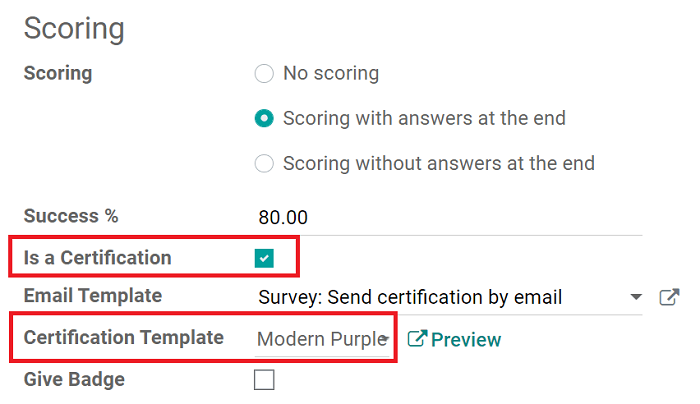

=======
Scoring
=======

Surveys are a great way to measure a person's performance, knowledge of a subject, or overall
satisfaction.

Odoo allows you to attach points to certain answers of survey questions. These points are then
summed up to give your participant a final score.

Scoring configuration
=====================

Under the *Options* tab on a survey detail form, users have the option to choose between:
*Scoring with answers at the end* **or** *Scoring without answers at the end*.

.. image:: scoring/survey-options-tab.png
   :align: center
   :alt: survey option template tab

You can set the "*Success %*" here, as well. The "*Success %*" is the score the user will need to
achieve in order to have successfully taken the survey.

.. image:: scoring/survey-success-percentage.png
   :align: center
   :alt: survey success percentage setting

If "*Is a Certification*" is selected, you can choose its template. The certification is
automatically emailed to users who have successfully finished the survey.

.. note::
   The *Give Badge* feature is **only** available if you enable *Login required* in the
   *Candidates* section of the *Options* tab of the survey detail form.

Then, choose a survey question you want to assign a point value to, and mark which answer is
"correct" on the question pop-up. You can also apply negative point results for "incorrect"
answers, as well.

.. image:: scoring/answers-questions-points.png
   :align: center
   :alt: answer tab of survey with questions and points
