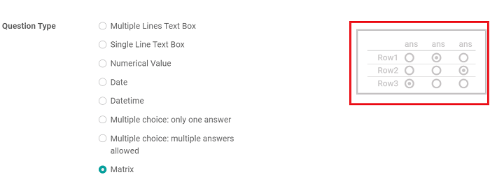
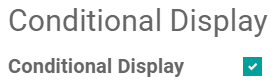
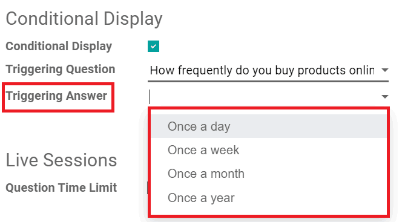
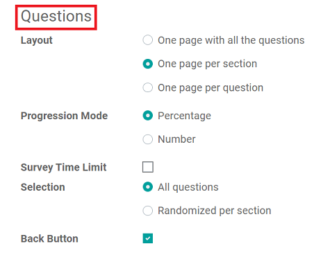
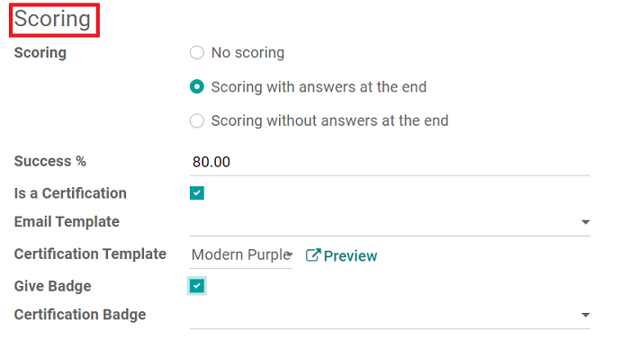
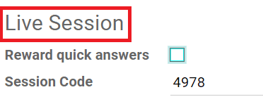

=================
Survey essentials
=================

Companies often use surveys to collect valuable information from their customers and/or
employees, which they use to make more informed business decisions.

Surveys can be used for a number of different purposes. They can be used to collect customer
feedback, evaluate the success of a recent event, measure the satisfaction of customers (and
employees), learn what the market is *really* thinking, and so much more.

Getting started
===============

To begin, click *Create* on the Surveys dashboard.

.. image:: survey_essentials/create-button-surveys.png
   :align: center
   :alt: the create button on the surveys dashboard

Odoo then takes you a blank survey template form. First, choose a title for your survey. You can
also add a cover image to your survey by clicking the photo icon here, as well, but it's not
required.

.. image:: survey_essentials/title-photo-icon.png
   :align: center
   :alt: survey title field and upload photo icon

Below are the various tabs in which you can create, customize, and configure your survey:
*Questions*, *Description*, and *Options*

.. image:: survey_essentials/questions-description-options.png
   :align: center
   :alt: various tabs that can be found on survey template page

Questions tab
=============

Users add sections and questions to their survey in the *Questions* tab, by clicking the
respective links (*Add a section* and *Add a question*).

Clicking *Add a question* opens a pop-up. This is where you create and customize your survey
question.

.. image:: survey_essentials/survey-question-pop-up.png
   :align: center
   :alt: blank survey question pop-up window

Create questions
----------------

After the question has been written in the "Question" field, you choose the "Question Type." A
preview of the question type is shown in this window, as well.

You can choose from the following:

* **Multiple Lines Text Box**
* **Single Line Text Box**
* **Numerical Value**
* **Date**
* **Datetime**
* **Multiple choice: only one answer**
* **Multiple choice: multiple answers allowed**
* **Matrix**

.. note::
   Each "Question Type" reveals different features/options in the *Answers* and *Options* tab that
   are specific to that unique "Question Type." However, the *Description* tab will always remain
   the same.

Custom features
---------------

Once a "Question Type" has been selected, you can modify your question in the *Answers*,
*Description*, and *Options* tab, which offer up a variety of different features (depending on
what "Question Type" you are working on).

Odoo provides the user with a plethora of professional features and options, so be sure to check
each tab for an array of unique aspects. There are a number of things you can do to enhance the
quality of your question.

For example, you can choose to validate an entry, make an answer mandatory, or activate
"Conditional Display."

"Conditional Display"
---------------------

"Conditional Display" means this question will only be displayed if the specified conditional
answer has been selected in a previous question.

.. image:: survey_essentials/conditional-triggering-fields.png
   :align: center
   :alt: conditional display and triggering fields

If the box next to "Conditional Display" is selected, the "Triggering Question" field appears.
Once a "Triggering Question" is picked, a "Triggering Answer" field appears.

Here, you select which answer triggers this "Conditional Display" question.

.. note::
   When you are done, remember to hit *Save & Close*, which takes you back to the survey template
   page. You can also hit *Save & New* to instantly start working on another question.

Description tab
===============

Back on the survey template page, you can click into the *Description* tab to write a custom
description for your survey, which is displayed beneath the title on the survey's homepage.

.. image:: survey_essentials/survey-description-tab.png
   :align: center
   :alt: back-end view of how survey description looks

Here's what it looks like on your website:

.. image:: survey_essentials/front-end-description.png
   :align: center
   :alt: front-end view of how survey description looks

Options tab
===========

Under the *Options* tab, there are different sections of settings you can modify.

* **Questions**
* **Scoring**
* **Candidates**
* **Live Session**

.. image:: survey_essentials/survey-options-tab.png
   :align: center
   :alt: options tab on survey template form

Questions
---------

This section primarily focuses on the overall presentation of your survey.

First, you select the layout. You can choose from:

* *One page with all the questions*
* *One page per section*
* *One page per question*

You can also choose how you want to display the participant's progress during the survey. It can
be shown as either a *Percentage* or a *Number*.

Below that, you can choose to put a time limit on your survey, modify the question selection, and
decide if you'd like to present your participants with a *Back Button*.

.. seealso::
    - :doc:`time_random`

Scoring
-------

In this section, you decide how you want the survey to be scored. You can choose from the following:

* *No scoring*
* *Scoring with answers at the end*
* *Scoring without answers at the end*

If you select either *Scoring with answers at the end* or *Scoring without answers at the end*,
two more fields appear. In which, you decide what the "Success %" is, and you can choose to make
this a certification.

If you check the box next to "Is a certification," three more additional fields appear. You can
pick an email template, certification template, and choose to give participants a badge for
successfully completing the survey.

And, if you check the box next to "Give Badge," you are able to select which Certification Badge
you want to give to your participants.

.. seealso::
    - :doc:`scoring`

Candidates
----------

In this section, you can decide who can access this survey.

The "Access Mode" allows you to choose between *Anyone with the link* and *Invited people only*.
You can also decide if you want to grant access to *Appraisal Managers Only*.

You are also able to decide if you want to require a login to participate in this survey here, as
well.

If you check the box next to "Attempts Limit," a new field appears, in which you will enter in
how many attempts you are willing to give to your participants.

.. image:: survey_essentials/candidates-section.png
   :align: center
   :alt: candidates section of survey settings

Live Session
------------

This section is dedicated to users who are conducting Live Session surveys, wherein they directly
engage with an audience at the same time - much like a live event.

Here, you can choose to reward participants for quick answers, as well as customize the specific
"Session Code" that participants would need in order to access the Live Session survey.

Test & share
============

Once your survey is saved and ready, you can test it to check for possible errors before sending it
out to your participants.

Simply click *Test* in the upper left corner of the survey template page.

.. image:: survey_essentials/test-survey-button.png
   :align: center
   :alt: test smart button on survey template form

When clicked, Odoo takes you to survey on the front-end of the website, and shows you how the
survey looks to participants. You can then proceed to run through the survey, like a normal
participant, to check for any errors.

Along the top of the page, there's a blue banner, signifying that this is a test survey. To return
to the survey template form on the backend, click that link in the blue banner.

.. image:: survey_essentials/blue-banner-test.png
   :align: center
   :alt: blue banner on test survey with link

Once there, you can make any additional changes or modifications that you'd like, before sending it
out to potential participants.

Then, when you're satisfied with how the survey looks, you can click *Start Survey* in the
upper-left corner.

.. image:: survey_essentials/start-survey-button.png
   :align: center
   :alt: start survey smart button on survey template form

When clicked, the status of the survey moves from *Draft* to *In Progress*, and more buttons appear.

.. image:: survey_essentials/survey-status-bar.png
   :align: center
   :alt: survey status bar from draft to in progress

* *Share* - email potential participants a link and invitation to the survey
* *See Results* - provides a visual representation of all the answers so far
* *Create Live Session* - starts a Live Session, and provides a specific URL for participants
* *Test* - test out the survey to check for errors
* *Print* - print out the survey
* *Close* - officially close the survey to participants

.. image:: survey_essentials/new-survey-button-options.png
   :align: center
   :alt: new buttons present on survey template form

Also, as answers get collected, you can check them by clicking the *Answers* smart button on the
survey template form.

.. image:: survey_essentials/survey-answers-button.png
   :align: center
   :alt: answers smart button on survey template

You can also access the detailed answers by going to
:menuselection:`Participations --> Participations`, as well.

.. image:: survey_essentials/participations.png
   :align: center
   :alt: the participations drop-down menu with participations

Once there, simply open up the survey you wish to examine, and click on any answer form to gain
more information.

.. image:: survey_essentials/survey-participations-page.png
   :align: center
   :alt: survey drop-down open on participations page

.. seealso::
    - :doc:`scoring`
    - :doc:`time_random`
