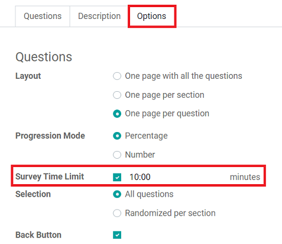
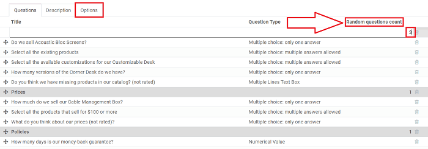

============================
Timed & randomized questions
============================

Timed
=====

With timed surveys, participants must complete the survey within a predetermined amount of time.
You can apply the same time limit feature to individual questions, as well.

Timed surveys and questions ensure that all participants get the same amount of time to answer and
complete the survey. They also discourage participants from looking up answers with external
sources.

Timed surveys
-------------

To set a time limit on a survey, go to the survey template page, go to
:menuselection:`Options Tab --> Select "Survey Time Limit"`, and enter in your desired time limit
(in minutes).

Before participants begin, they will see how much allotted time they have to complete the survey.
During the survey, a timer is shown on the pages so the user can keep track of the remaining time.

.. image:: time_random/time-limit-survey-clock.png
   :align: center
   :alt: survey time limit clock display front-end

.. note::
   Surveys that are not submitted in time **do not** have their answers saved.

Timed questions (in *Live Sessions* only)
-----------------------------------------

Timed questions are only available during Live Session surveys.

To put a time limit on a specific question, simply click the question you wish to modify, and go to
:menuselection:`Options Tab --> Question Time Limit`. At that point, you can specify the time
limit (in seconds).

.. image:: time_random/question-time-limit.png
   :align: center
   :alt: survey question time limit

Randomized
==========

When a survey is randomized, the questions will be shuffled in a random order every time a
participant opens the survey. Random surveys are a great way to eliminate the possibility of
participants copying off one another.

Randomized surveys
------------------

To randomize a survey, go to
:menuselection:`Options Tab (of the survey) --> Select "Randomized per section"`.

.. image:: time_random/randomized-per-section.png
   :align: center
   :alt: survey randomized per section option

Once you've enabled that feature, go to the *Questions* tab of the survey, where a
*Random questions count* column is now present.

Here you can decide how many of the questions should be taken into account during the shuffling.

.. seealso::
    - :doc:`survey_essentials`
    - :doc:`scoring`
