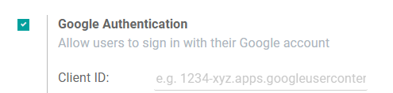

=======================================
Integrate Google Sign-In Authentication
=======================================

The **Google Sign-In Authentication** is a useful function that allows your users to sign in to Odoo 
with their Google account.

This is particularly helpful if your organization uses Google Workforce and you want the employees 
within your organization to connect to Odoo with their Google Accounts.

.. _google/configuration:

Configuration
=============

The integration of the Google sign-in function requires configuration both on Google and on Odoo.

.. _google/google-api:

Google API Dashboard
--------------------

#. Go to the `Google API Dashboard <https://console.developers.google.com/>`_.

#. Make sure the right project is opened. If you don't have a project yet, click on *Create 
   Project*, fill out the project name and other details of your company, and click on *Create*.

   .. image:: media/google-auth-new-project-details.png
      :align: center
      :alt: Filling out the details of a new project

   .. note::
      Choose the name of your own company from the drop-down menu.

.. _google/oauth:

OAuth consent screen
~~~~~~~~~~~~~~~~~~~~

#. On the left side menu, click on :menuselection:`OAuth consent screen`.

   .. image:: media/google-oauth-consent-selection.png
      :align: center
      :alt: Google oauth consent selection menu

#. Choose one of the options **(Internal / External)** as instructed, and click on *Create*.

   .. image:: media/google-oauth-consent.png
      :align: center
      :alt: Choice of a user type in oauth consent

#. Fill out your details and domain info, then click on *Save and Continue*.

   .. image:: media/google-auth-edit-app-registration.png
      :align: center
      :alt: Edit app registration page

#. Once on the **Scopes** page, leave all fields as is, and click on *Save and Continue*

.. _google/credentials:

Credentials
~~~~~~~~~~~

#. On the left side menu, click on :menuselection:`Credentials`.

   .. image:: media/google-auth-credentials-button.png
      :align: center
      :alt: Credentials button menu

#. Click on *Create Credentials* and select **OAuth client ID**.

   .. image:: media/google-oauth-client-id.png
      :align: center
      :alt: Oauth client id selection

#. Select **Web Application** as the Application type. Now configure the allowed pages on which you 
   will be redirected. 
   
   In order to achieve this, in the **Authorized redirect URIs** field, enter your database's domain 
   immediately followed by ``/auth_oauth/signin``. For example: 
   ``https://mydomain.odoo.com/auth_oauth/signin``, then click on *Create*.

   .. image:: media/google-create-oauth-client-id.png
      :align: center
      :alt: Creating oauth client id

.. _google/auth-odoo:

Google Authentication on Odoo
-----------------------------

.. _google/client-id:

Retrieve the Client ID
~~~~~~~~~~~~~~~~~~~~~~

Once you have done the previous steps, two infos are received: Client ID and Client Secret. 

.. image:: media/google-auth-secret-ids.png
   :align: center
   :alt: Secret ids display

.. _google/odoo-activation:

Odoo activation
~~~~~~~~~~~~~~~

*Fill out* your Client ID into the **General Settings** on Odoo (under **Integrations**).
	

.. seealso::
   - `Google Cloud Setting up OAuth 2.0 <https://support.google.com/cloud/answer/6158849>`_
